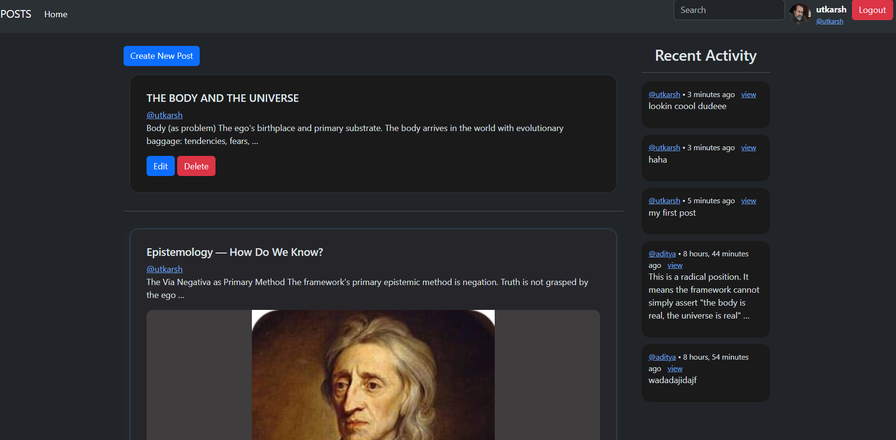
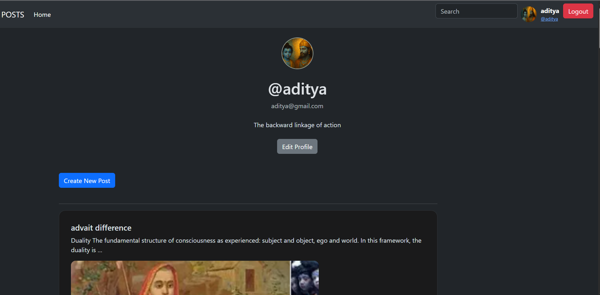

# 🧠 Django Social App

A full-stack Django web application with authentication, user profiles, posts, comments, and a modern UI.
### 📝 Home Feed


### 👤 Profile Dropdown


---


## 🚀 Features

### 🔐 Authentication System

* Custom user model (email-based login)
* Login with **email or username**
* Register / Login / Logout
* Secure logout using POST (CSRF protected)

---

### 👤 User Profile

* Custom user model with:

  * Username
  * Email (unique)
  * Bio
  * Profile picture
* Edit profile functionality
* Profile picture preview
* Navbar profile dropdown

---

### 📝 Posts System

* Create / Edit posts
* Image upload support
* Clean card-based UI
* Post feed display
* Search posts (title + content)

---

### 💬 Comments System

* Add comments to posts
* Recent activity section
* Linked to user + post

---

### 🎨 UI/UX

* Modern dark theme
* Centered auth forms (login/register/edit)
* Responsive card layouts
* Gradient overlays on images
* Navbar with profile dropdown

---

## 🧱 Tech Stack

* **Backend:** Django
* **Frontend:** HTML, CSS (custom styling)
* **Database:** SQLite (default)
* **Authentication:** Django Auth (Custom User Model)
* **Media Handling:** Django Media Files

---

## ⚙️ Project Structure

```
project/
│
├── posts/                 # Main app
│   ├── models.py         # Post, Comment, CustomUser
│   ├── views.py
│   ├── forms.py
│   ├── urls.py
│
├── templates/
│   ├── layout.html
│   ├── home.html
│   ├── login.html
│   ├── register.html
│   ├── edit_profile.html
│
├── static/               # CSS, default images
├── media/                # Uploaded images
│
├── project/
│   ├── settings.py
│   ├── urls.py
│
└── manage.py
```

---

## 🔧 Setup Instructions

### 1️⃣ Clone the repository

```bash
git clone https://github.com/your-username/your-repo.git
cd your-repo
```

---

### 2️⃣ Create virtual environment

```bash
python -m venv venv
venv\Scripts\activate   # Windows
```

---

### 3️⃣ Install dependencies

```bash
pip install -r requirements.txt
```

---

### 4️⃣ Run migrations

```bash
python manage.py makemigrations
python manage.py migrate
```

---

### 5️⃣ Run server

```bash
python manage.py runserver
```

---

## 📁 Media Setup (IMPORTANT)

In `settings.py`:

```python
MEDIA_URL = '/media/'
MEDIA_ROOT = BASE_DIR / 'media'
```

In `urls.py`:

```python
from django.conf import settings
from django.conf.urls.static import static

if settings.DEBUG:
    urlpatterns += static(settings.MEDIA_URL, document_root=settings.MEDIA_ROOT)
```

---

## 🔑 Custom User Model

```python
class CustomUser(AbstractUser):
    username = models.CharField(max_length=150, blank=True, null=True)
    email = models.EmailField(unique=True)
    bio = models.TextField(blank=True, null=True)
    profile_picture = models.ImageField(upload_to='profile_pictures/', blank=True, null=True)

    USERNAME_FIELD = 'email'
    REQUIRED_FIELDS = ['username']
```

---

## 🔍 Key Concepts Implemented

* Django ORM queries (`Q`, filtering, ordering)
* ModelForms for clean data handling
* Custom authentication logic (email/username login)
* Media file handling
* Template inheritance
* CSRF protection
* Login required decorators

---

## 🚀 Future Improvements

* 🔥 Like / Share system
* 🔔 Notifications
* 📱 Fully responsive design
* 🌐 REST API using Django REST Framework
* 🧾 Pagination
* 🔒 Password reset via email

---

## 🧑‍💻 Author

**Aditya Kaintura**

---

## ⭐ Notes

This project was built as part of backend learning and progressively improved with:

* Real-world features
* UI enhancements
* Best practices in Django

---

## 📌 License

This project is for learning purposes.
